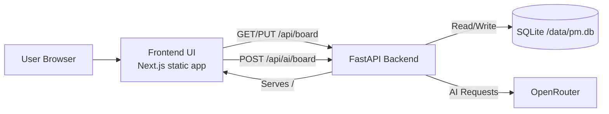
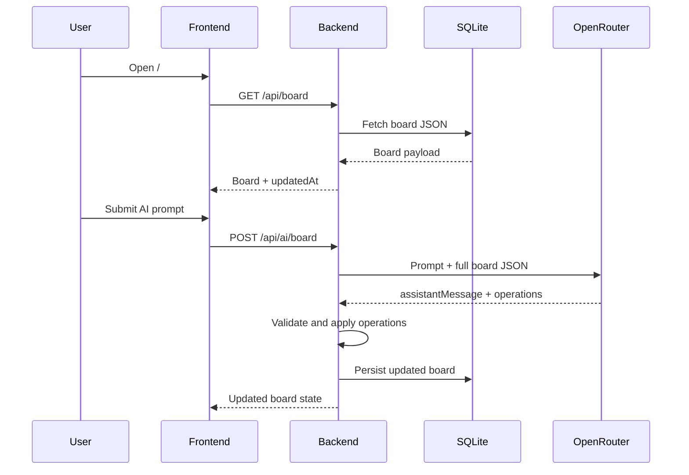

# Project Management MVP
## Product and Design Document

| Field | Value |
|---|---|
| Version | 1.2 |
| Last Updated | 2026-07-10 |
| Project Root | `pm/` |
| Audience | Future developers, maintainers, QA engineers |
| Status | MVP complete (Parts 1-10), verification complete |

> Source of truth for architecture, API contracts, data model, operations, testing baseline, and incident history.

---

## Table of Contents
1. [Executive Summary](#executive-summary)
2. [Product Scope](#product-scope)
3. [Requirements Alignment](#requirements-alignment)
4. [System Architecture](#system-architecture)
5. [Tech Stack and Tooling](#tech-stack-and-tooling)
6. [Repository Structure](#repository-structure)
7. [API Contract](#api-contract)
8. [Data Model](#data-model)
9. [Deployment and Operations](#deployment-and-operations)
10. [Testing and Quality Baseline](#testing-and-quality-baseline)
11. [Problems Encountered and Resolutions](#problems-encountered-and-resolutions)
12. [Known Limitations and Technical Debt](#known-limitations-and-technical-debt)
13. [Recommended Next Steps](#recommended-next-steps)
14. [Quick Reference](#quick-reference)

---

## Executive Summary

This repository delivers a local-first project management MVP with a Kanban board and AI-assisted board updates.

The platform combines:
- Next.js frontend (static export)
- FastAPI backend (API + static hosting)
- SQLite persistence
- OpenRouter AI integration
- Dockerized local runtime

Planned scope in `docs/PLAN.md` is complete. Verification is also complete: lint, unit tests, E2E tests, and coverage baselines.

## Release Notes (Final MVP)

Release Date: 2026-07-10

### Highlights
- Completed all planned implementation parts (Part 1 through Part 10).
- Delivered persistent Kanban board workflow backed by FastAPI + SQLite.
- Added AI sidebar with validated server-side operation application.
- Finalized Dockerized local runtime with cross-platform start and stop scripts.

### Quality Summary
- Frontend lint: pass.
- Frontend test suite: pass (`npm run test:all`).
- Frontend unit coverage: `80.73%` statements.
- Backend tests: `22 passed`.
- Backend coverage: `86%` total.

### Notable Reliability Improvements
- Stabilized E2E drag-and-drop tests with deterministic board reset.
- Standardized Playwright runs on installed Chrome channel in this environment.
- Added backend AI fallback behavior for `429` during connectivity checks.

---

## Product Scope

### In Scope
- Client-side sign-in gate with fixed credentials.
- Single board per signed-in user.
- Fixed columns with editable names.
- Card create, edit, move, delete.
- Drag-and-drop interactions.
- AI chat sidebar that can mutate board state through validated operations.
- Backend persistence with SQLite.
- Local Docker workflow.

### Out of Scope (MVP)
- Production auth/authorization.
- Multi-board UX.
- Multi-user collaboration UI.
- Real-time conflict resolution.
- Advanced analytics/reporting.

---

## Requirements Alignment

| Requirement | Status | Notes |
|---|---|---|
| User can sign in | Complete | Hardcoded `user/password` gate in frontend |
| Kanban board shown after sign-in | Complete | Board gated behind login state |
| Columns fixed and renameable | Complete | Rename supported in board UI |
| Cards draggable and editable | Complete | DnD + CRUD interactions implemented |
| AI sidebar can create/edit/move cards | Complete | Structured operation pipeline with server validation |

### Model Configuration Note
- Original planning note referenced `openai/gpt-oss-120b:free`.
- Current backend default is `qwen/qwen3-coder:free`.
- Connectivity check retries once with `openai/gpt-4o-mini` on `429`.
- Frontend AI requests currently pin `model=openai/gpt-4o-mini` for reliability in this environment.

---

## System Architecture

### High-Level Components



### Runtime Interaction Flow



### Deployment Model
- Single container serves API and static frontend.
- Docker compose mounts persistent volume for SQLite data.
- Runtime defaults:
  - App port: `8000`
  - DB path: `/data/pm.db`

---

## Tech Stack and Tooling

| Layer | Tools |
|---|---|
| Frontend | Next.js 16, React 19, TypeScript, Tailwind v4 |
| UX Interaction | `@dnd-kit/core`, `@dnd-kit/sortable` |
| Backend | FastAPI, Pydantic, Uvicorn |
| Persistence | SQLite (stdlib `sqlite3`) |
| AI | OpenRouter API |
| Testing | Vitest, Testing Library, Playwright, pytest, pytest-cov |
| Packaging | Docker multi-stage build, docker-compose |
| Python dependency install in container | `uv pip install -r backend/requirements.txt` |

---

## Repository Structure

```text
pm/
|- AGENTS.md
|- Dockerfile
|- docker-compose.yml
|- PROJECT_DESIGN_DOCUMENT.md
|- backend/
|  |- main.py
|  |- db.py
|  |- ai.py
|  |- ai_actions.py
|  |- tests/
|- docs/
|  |- PLAN.md
|  |- DB_MODEL.md
|  |- RUN.md
|- frontend/
|  |- src/
|  |- tests/
|- scripts/
   |- start/stop scripts for Windows/macOS/Linux
```

### Core Ownership
- `backend/main.py`: route layer and app composition.
- `backend/db.py`: schema init and board persistence.
- `frontend/src/components/KanbanBoard.tsx`: board orchestration, persistence calls, AI sidebar integration.
- `frontend/src/lib/api.ts`: frontend API client contract.

---

## API Contract

### Health and Static

| Method | Route | Purpose | Success |
|---|---|---|---|
| GET | `/api/health` | Service health check | `{"status":"ok","service":"pm-backend"}` |
| GET | `/hello` | Basic HTML smoke page | HTML response |
| GET | `/` | Frontend static app | `200` when `frontend/out` exists |

### Board APIs

| Method | Route | Request | Response | Errors |
|---|---|---|---|---|
| GET | `/api/board?username=user` | None | `username`, `board`, `updatedAt` | `404` unknown user/board |
| PUT | `/api/board?username=user` | `{"board":{"columns":[...],"cards":{...}}}` | `username`, `board`, `updatedAt` | `422` invalid shape, `404` unknown user |

### AI APIs

| Method | Route | Request | Response | Errors |
|---|---|---|---|---|
| GET | `/api/ai/test` | Query: `live`, optional `model` | readiness metadata or live `2+2` result | `503` missing key, `502` upstream error |
| POST | `/api/ai/board` | `{"prompt":"..."}` + optional query `username`, `model` | `assistantMessage`, `operationsApplied`, `board`, metadata | `422` invalid operations, `503` missing key, `502` upstream/format errors |

### Supported Structured AI Operation Types
- `create_card`
- `edit_card`
- `move_card`
- `delete_card`
- `rename_column`

---

## Data Model

### SQLite Runtime Location
- Default: `/data/pm.db`
- Persisted by compose volume: `pm_data:/data`

### Schema (MVP)

```sql
CREATE TABLE IF NOT EXISTS users (
  id INTEGER PRIMARY KEY AUTOINCREMENT,
  username TEXT NOT NULL UNIQUE,
  created_at TEXT NOT NULL DEFAULT (strftime('%Y-%m-%dT%H:%M:%fZ', 'now'))
);

CREATE TABLE IF NOT EXISTS boards (
  id INTEGER PRIMARY KEY AUTOINCREMENT,
  user_id INTEGER NOT NULL UNIQUE,
  board_json TEXT NOT NULL,
  updated_at TEXT NOT NULL DEFAULT (strftime('%Y-%m-%dT%H:%M:%fZ', 'now')),
  created_at TEXT NOT NULL DEFAULT (strftime('%Y-%m-%dT%H:%M:%fZ', 'now')),
  FOREIGN KEY (user_id) REFERENCES users(id) ON DELETE CASCADE
);

CREATE INDEX IF NOT EXISTS idx_users_username ON users(username);
```

### Board JSON Contract
- `board.columns`: ordered array of columns.
- `board.cards`: dictionary keyed by card id.

### Startup Guarantees
- DB directory exists.
- Schema exists.
- Baseline user `user` exists.
- Baseline board exists for that user.

---

## Deployment and Operations

### Local Start and Stop

From repository root:

```powershell
# PowerShell
./scripts/start.ps1
./scripts/stop.ps1
```

```bat
:: CMD
scripts\start.bat
scripts\stop.bat
```

```bash
# macOS/Linux
./scripts/start.sh
./scripts/stop.sh
```

### Smoke Checks
- `http://localhost:8000/hello`
- `http://localhost:8000/api/health`

### Compose Behavior
- Exposes `8000:8000`
- Loads environment from `.env`
- Persists SQLite data in named volume `pm_data`

### Required Environment
- `OPENROUTER_API_KEY` for live AI calls
- Optional `DB_PATH` override

---

## Testing and Quality Baseline

### Current Verified Baseline

| Area | Result |
|---|---|
| Frontend lint | Pass |
| Frontend unit tests | Pass |
| Frontend E2E tests | Pass |
| Frontend unit coverage | `80.73%` statements |
| Backend tests | `22 passed` |
| Backend coverage | `86%` total |

### Standard Commands

```bash
# Frontend
cd frontend
npm run lint
npm run test:unit
npm run test:e2e
npm run test:all
npm run test:unit -- --coverage

# Backend
cd backend
python -m pytest -q
python -m pytest --cov=. --cov-report=term-missing -q
```

---

## Problems Encountered and Resolutions

This register captures implementation and verification incidents with root cause, fix, and prevention.

| ID | Problem | Root Cause | Resolution | Prevention | Status |
|---|---|---|---|---|---|
| 1 | Docker compose failed with dockerDesktopLinuxEngine pipe error | Docker daemon not running | Start Docker Desktop daemon and rerun compose | Add daemon preflight check in run docs/scripts | Closed |
| 2 | Container dependency install failed when installing project from `pyproject.toml` | Package-layout assumptions did not match app-script structure | Install runtime deps from `backend/requirements.txt` via `uv pip install -r` | Keep runtime install file-based until full package layout exists | Closed |
| 3 | Playwright Chromium cache instability | Environment-specific managed browser cache issues | Use installed Chrome channel for E2E | Keep Playwright configured to Chrome channel here | Closed |
| 4 | Flaky DnD E2E move test | Persistent board state + layout-sensitive drag geometry | Reset board seed before each test and drag to deterministic adjacent target | Maintain deterministic test setup and stable targets | Closed |
| 5 | Card remove button overflow at some breakpoints | Layout did not wrap robustly at narrower widths | Update card wrapping and board breakpoints (`sm=2`, `lg=3`, `2xl=5`) | Include responsive interaction checks in QA | Closed |
| 6 | OpenRouter `429` during connectivity checks | Rate limit on free model | Add one-time fallback to `openai/gpt-4o-mini` | Keep fallback strategy and monitor provider limits | Closed |
| 7 | Invalid structured AI operations returned | AI output ambiguity around required IDs | Tighten system instructions + strict backend validation + safe `422` rejection | Keep contract explicit and validated server-side | Closed |
| 8 | `pytest --cov` unavailable initially | `pytest-cov` missing in dev deps | Add `pytest-cov` to backend dev requirements | Keep CI/dev tooling dependencies explicit | Closed |
| 9 | Invalid dependency entry `httpx2` | Typo in dev requirements | Correct to `httpx` | Validate deps during setup/CI | Closed |
| 10 | `pytest` command not found in some shells | Scripts path not on `PATH` | Use `python -m pytest` | Document module invocation as standard | Closed |
| 11 | `ResourceWarning` for unclosed sqlite connections in tests | Some connection lifecycle paths remain non-deterministic | Logged as technical debt; tests still pass | Audit and enforce deterministic connection close paths | Open |
| 12 | Risk of `IndentationError` from mixed indentation in backend route file | Inconsistent Python indentation | Normalize to 4-space indentation | Enforce formatting in editor/CI | Closed |

---

## Known Limitations and Technical Debt

- Authentication is client-side and hardcoded for MVP.
- UX is single-user, single-board.
- Board persistence uses full-document overwrite (no patch protocol).
- Backend test suite still emits sqlite `ResourceWarning` messages in some runs.
- Model policy differs between original planning note and current implementation defaults.

---

## Recommended Next Steps

### 1) Security and Auth
- Replace client-only gate with backend-issued session or token auth.

### 2) Data Evolution
- Add board versioning and optimistic concurrency.
- Consider normalization if query complexity increases.

### 3) AI Reliability
- Tighten schema enforcement and improve operation-level telemetry.
- Align and document single model policy for all AI paths.

### 4) CI and Quality Gates
- Add CI pipeline for lint, unit, E2E, and coverage thresholds.
- Track warning budget and reduce sqlite `ResourceWarning` count to zero.

### 5) Operational Hardening
- Add startup preflight checks for Docker and required env vars.
- Extend runbook with failure signatures and one-step fixes.

---

## Quick Reference

### URLs
- App: `http://localhost:8000`
- Smoke: `/hello`, `/api/health`

### Core API Routes
- `GET /api/board`
- `PUT /api/board`
- `GET /api/ai/test`
- `POST /api/ai/board`

### Primary Project Docs
- `AGENTS.md`
- `docs/PLAN.md`
- `docs/DB_MODEL.md`
- `docs/RUN.md`
- `frontend/AGENTS.md`
- `backend/AGENTS.md`

---

_End of document._
